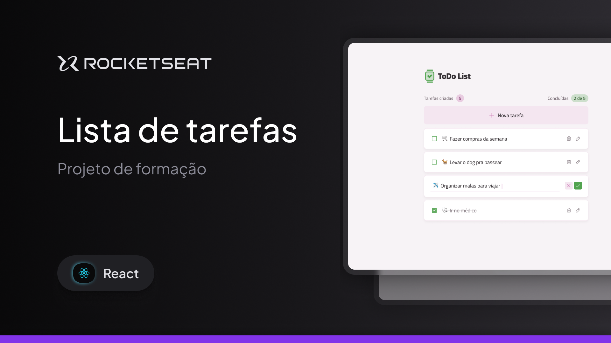

<h1 align="center">
     
</h1>

---

## 🏷️ Sobre 
**todo**: Desafio proposto durante o primeiro módulo do curso de ReactJS da trilha Ignite na Rocketseat.
O desafio proposto era:
- [x] Desenvolver a aplicação a partir do layout no Figma
- [x] Adicionar uma nova tarefa
- [x] Marcar e desmarcar uma tarefa como concluída
- [x] Remover uma tarefa da listagem
- [x] Editar uma tarefa 
- [x] Mostrar a quantidade de tarefas 
- [x] Mostrar o progresso de conclusão das tarefas

---

## 🛠️ Tecnologias e serviços utilizados
Foram utilizadas as seguintes tecnologias para desenvolver a aplicação **todo** :

- [TailwindCSS](https://tailwindcss.com/)
- [HTML5](https://html.com/)
- [CVA](https://cva.style/docs)
- [React.js](https://pt-br.reactjs.org/)
- [TypeScript](https://www.typescriptlang.org/)
- [Vite](https://www.vitetlang.org/)


---

## 🗂️ Como baixar e iniciar o projeto 

```bash

    #clonar o projeto
    $ git clone https://github.com/joaopedrovidal/ToDo-List.git

    #entrar no diretório
    $ cd todo

    #instalar as dependências
    $ pnpm install

    #iniciar a aplicação
    $ pmpm dev
```
### Servidor local
localhost:5173

---

## Autor
### 👤 João Pedro Vidal

- Linkedin: [@joaopedrovidal](https://www.linkedin.com/in/jo%C3%A3opedrovidaldossantos/)
- Github: [@joaopedrovidal](https://github.com/joaopedrovidal)
- Deploy: [Vercel](https://todo-list-six-phi-71.vercel.app/)

---
## 📝 Licença
Copyright © 2025 [@joaopedrovidal]

---

### Desenvolvido 💜 by João Pedro Vidal
